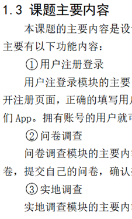

# 📝实训报告格式自检

  ## 任务总览
  - **总积分**：0
  - **已解锁徽章**：无

  ## 🛠️整体检查

  - [ ] **字数不少于 1W5**🧐，代码需要用截图来表示📸 <!-- points:10 --> {#task-word-count}
  - [ ] **最后页码 ≥ 50** 📄 <!-- points:10 --> {#task-last-page}
  - [ ] 页眉页码是否正确设置（页眉 1.6，页码 2.1）✔️，且整体是否完成以下要求：
    - 奇偶页不同页眉 <!-- points:5 --> {#task-header-odd-even}
    - 前置部分为罗马数字（i, ii, iii...） <!-- points:5 --> {#task-roman-numbers}
    - 正文部分为阿拉伯数字（1, 2, 3...）🔢 <!-- points:5 --> {#task-arabic-numbers}
  - [ ] 页面设置是否正确🖥️ <!-- points:10 --> {#task-page-setup}
  - [ ] 一级标题是否正确设置 <!-- points:10 --> {#task-level-1-title}
    - **前后均空一行**
    - 必须出现在一页的最上方 👌
  - [ ] 二级标题，左对齐： <!-- points:10 --> {#task-level-2-title}
    - **前有一空行**，后面没有空行 📝
  - [ ] 三级标题： <!-- points:10 --> {#task-level-3-title}
    - **缩进两个字符**，**前后均无空行** ➡️
  - [ ] 正文格式是否符合以下要求： <!-- points:15 --> {#task-body-format}
    - 行距、字体大小正确 ✔️（如字体为小四号字；间距设置为标准字间距，行间距设置为固定值20磅）
    - 中英文字体类型符合要求（如中文字体为宋体，英文为：Times New Roman） 📐
  - [ ] 标题格式是否符合要求（**注意都不需要加粗**） 🔍 <!-- points:10 --> {#task-title-format}
  - [ ] 第一次出现英文缩写是否有全称： <!-- points:10 --> {#task-english-abbr}
    - **英文全称 + 中文解释** 🌏

---

  ## 📚 封面

  - [ ] 是否实训报告封面🖼️ <!-- points:5 --> {#task-cover}
  - [ ] 院（系）是否正确填写🏫 <!-- points:5 --> {#task-department}
  - [ ] 专业班级 是否正确填写 （教务系统里的班级名称）🎓 <!-- points:5 --> {#task-class}
  - [ ] 下划线是否对齐，整体一致美观🧹 <!-- points:5 --> {#task-underline-alignment}
  - [ ] 落款日期是否为最新版论文日期📅 <!-- points:5 --> {#task-date}
  - [ ] 封面没有页眉页码❌ <!-- points:5 --> {#task-cover-header}

---

  ## ✍️中文摘要

  - [ ] 内容：三段式📝 <!-- points:10 --> {#task-chinese-abstract-content}
    
    （1）为什么做这个课题，是课题背景意义的浓缩；
    
    （2）本课题采用什么技术做了哪些工作；
    
    （3）做的效果如何，取得了什么成果。
    
  - [ ] 是否有页眉设置🖋️ <!-- points:5 --> {#task-chinese-abstract-header}
  - [ ] 是否有页码设置，且是罗马数字🔢 <!-- points:5 --> {#task-chinese-abstract-pagenum}
  - [ ] 字数是否超过300字🔠 <!-- points:5 --> {#task-chinese-abstract-wordcount}
  - [ ] 关键词，3-5个，从左到右，语义范围越来越小🧐 <!-- points:5 --> {#task-chinese-abstract-keywords}
  - [ ] 字体和段落格式是否符合要求，是否都使用中文标点符号🖍️ <!-- points:5 --> {#task-chinese-abstract-format}

---

  ## 🌎英文摘要

  - [ ] 是否为两端对齐📏 <!-- points:5 --> {#task-english-abstract-alignment}
  - [ ] 页眉页码是否正确设置📝 <!-- points:5 --> {#task-english-abstract-header}
  - [ ] 是否都使用了英文标点符号🔤 <!-- points:5 --> {#task-english-abstract-punctuation}

---

  ## 📑目录

  - [ ] 是否包括中英文摘要🎯 <!-- points:5 --> {#task-toc-include-abstract}
  - [ ] 是否只有一个小标题（一个二级目录下，不允许只有一个三级标题，如果有三级标题，那么就应该有两个及以上）📚 <!-- points:5 --> {#task-toc-subtitles}
  - [ ] 页眉是否正确设置🖋️ <!-- points:5 --> {#task-toc-header}
  - [ ] 页码是否正确设置，从中文到目录为止，是否都为罗马数字且连续。🔢 <!-- points:5 --> {#task-toc-pagenum}
  - [ ] 整体的目录结构是否符合标准（6个大章节） 🛠️ <!-- points:5 --> {#task-toc-structure}
  - [ ] 字体和段落格式是否正确。📖 <!-- points:5 --> {#task-toc-format}
  - [ ] 绪论部分中**是否有“课题主要内容” 小节**📖 <!-- points:5 --> {#task-toc-introduction}
  - [ ] **是否有“需求设计” 章节**🖥️ <!-- points:5 --> {#task-toc-requirements}
  - [ ] **是否有“系统设计与实现”章节**⚙️ <!-- points:5 --> {#task-toc-system-design}
  - [ ] **是否有“系统测试”章节**🧪 <!-- points:5 --> {#task-toc-system-testing}
  - [ ] **是否有“总结” 章节，且有两个小节（总结与展望** 🔮 <!-- points:5 --> {#task-toc-summary}

---

  ## 📖正文

  ### 正文内容格式

  | 理工类：                                        |
  | :---------------------------------------------- |
  | **1××××**（三号黑体，居中）                     |
  | ×××× (内容用小四号宋体)                         |
  | **1.1××××**（小三号黑体，居左）                 |
  | ××××（内容用小四号宋体）                        |
  | **1.1.1××××**（四号黑体，居左，右缩进两个字）   |
  | ××××（内容用小四号宋体）                        |
  | ①××××（用与内容同样大小的宋体，右缩进两个字）   |
  | 1）××××（用与内容同样大小的宋体，右缩进两个字） |
  | a．××××（用与内容同样大小的宋体）               |

  - [ ] 页眉是否正确设置。基本都是奇偶页页眉。 📝 <!-- points:5 --> {#task-body-header}
  - [ ] 页码是否正确设置，从阿拉伯数字开始。🔢 <!-- points:5 --> {#task-body-pagenum}
  - [ ] 二级标题和三级标题之间有一段引言描述。📋 如：

    2.2系统需求
    
      文字描述，文字描述
    
    2.2.1硬件需求
    
      文字描述，文字描述
    
  - [ ] 是否正确引用了。 <!-- points:10 --> {#task-citations}
    - 引用顺序是否正常🔄 <!-- points:5 --> {#task-citation-order}
    - 引用是否都在句号前面。🛑 <!-- points:5 --> {#task-citation-position}
    - **是否都在该引用的地方引用了（xxx等[2]提出），不允许连续几个大段都在最后一话上引用** 📚 <!-- points:5 --> {#task-citation-location}
    
  - [ ] 序号是否正确使用。如：（图为正确使用）
    
    （缩进2字符）XXXXXX（正文）
    
    （缩进2字符）①XXXXXXXX
    
    （缩进2字符）XXXXXXXXX（正文）
    
    
    
  - [ ] 除一二级标题外，**所有部分只首行缩进两个字符** <!-- points:5 --> {#task-indent}
  - [ ] **不允许出现孤行。（页面最后一行是二级或三级标题，称为孤行）**⚠️ <!-- points:5 --> {#task-orphan-lines}
  - [ ] 最后总结部分，**必须包括论文总结、研究与展望两部分** <!-- points:10 --> {#task-final-summary}
    - 论文总结：描述本文采用什么技术主要完成了哪些工作 🏆 <!-- points:5 --> {#task-summary}
    - 研究与展望：描述针对课题哪些功能还有待优化，下一步工作的努力方向。🌟 <!-- points:5 --> {#task-future-work}

---

  ### 📊 表格

  - [ ] 表序、表题和表格内字体均为五号宋体✏️ <!-- points:5 --> {#task-table-font}
  - [ ] 表序和表题置于表格上方中间位置🗂️ <!-- points:5 --> {#task-table-position}
  - [ ] 应逐章单独编序，表序必须连续，不得重复或跳跃 <!-- points:5 --> {#task-table-sequence}
  - [ ] 表是否居中📖 <!-- points:5 --> {#task-table-center}
  - [ ] 是否在表的上下文中有提及该表。比如：在这个表的前面正文中有提及“如表 X.X 所示” <!-- points:5 --> {#task-table-referenced}
  - [ ] 没有图代替表🚫 <!-- points:5 --> {#task-table-no-image}

---

  ### 🖼️图

  - [ ] 图序和图题置于图下方中间位置🖋️ <!-- points:5 --> {#task-figure-position}
  - [ ] 图序、图题和图内字体均为五号宋体✍️ <!-- points:5 --> {#task-figure-font}
  - [ ] 图序逐章单独编序，图序必须连续，不得重复或跳跃🔄 <!-- points:5 --> {#task-figure-sequence}
  - [ ] 图是否居中📐 <!-- points:5 --> {#task-figure-center}
  - [ ] 是否在图的上下文中有提及该图。比如：在这个图的前面正文中有提及“如图 X.X 所示”🖼️ <!-- points:5 --> {#task-figure-referenced}

---

  ## 📖参考文献

  - [ ] 格式与百度学术或知网文献格式相同📚 <!-- points:5 --> {#task-references-format}
  - [ ] 字体、段落设置正确🖋️ <!-- points:5 --> {#task-references-formatting}

---

  ## ❤️致谢

  - [ ] 致谢内容撰写： <!-- points:10 --> {#task-acknowledgements}
    
    关于致谢，这不仅仅是课题实施环节的致谢，而是对大学生活的致谢，需要致谢所有帮组过你的人，包括父母家人，恋人，亲朋好友，学校师生，企业指导教师（他们是第一导师），以及企业培训老师，参考文献中的作者，还有其他你认为对你学习、生活帮组过的人。

  - [ ] **不要抄袭** 🚫 <!-- points:5 --> {#task-no-plagiarism}